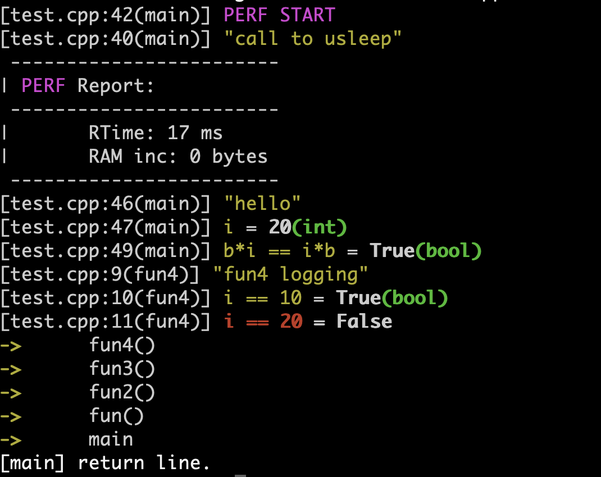

## libecho
    * libecho is a header-only library to perform plug-and-play debug.
    * Currently under development
    * Personal usage ONLY

#### Principles
    * Results reported as text-based log events
    * Plug and play using header-only libraries
    * No extra-dependencies

#### Aim features for 1st release
    * Support log for variables and expressions
    * Verbose mode
    * Expectation conditions analysis
    * Trance calls
    * Thread profiling
    * CPU profiling
    * Memory profiling
    * I/O profiling
    * Distributed as conan package
    * Doxygen & gitpage

#### Build & Execute test/test.cpp

